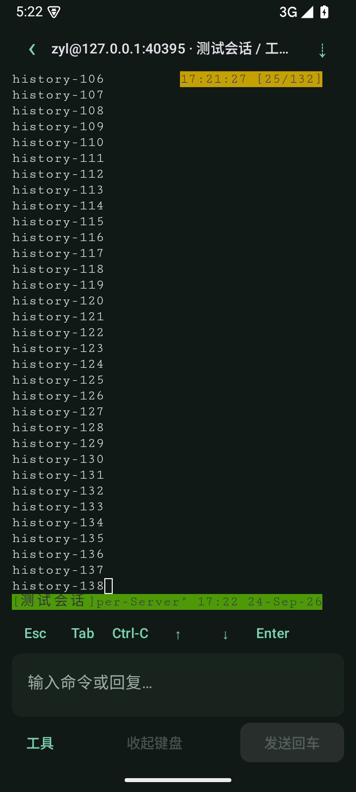
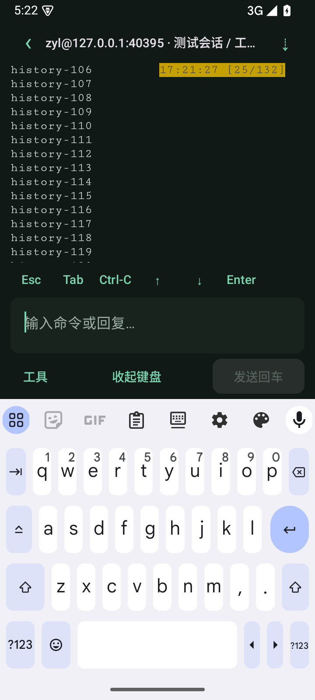

# 0.3.0：沉浸终端与键盘阅读位置保持

2026-09-24，versionCode 11。基于 [终端 UI 方案](../design/ui-plan.md) 完成实现，README 和设备清单已同步。

## 界面变化

- 顶部一行：返回首页、服务器与 tmux 会话/窗口名称、回到底端。服务器别名优先；长标题省略，点击可查看完整连接信息。
- 移除“终端”标题、断开按钮、常驻技术状态行和终端描边；背景与页面一致，左右保留 12dp。系统状态栏使用适合深色背景的图标。
- 终端下方为 Esc/Tab/Ctrl-C/方向键/Enter，接固定高度的回复框；底栏依次为工具、收起键盘、发送回车。
- 移除历史快照及“退出滚动”操作行。工具改为底部面板，保留仅粘贴、复制、字号/滚动偏好、回复目标与显式重新绑定。
- 连接错误、断线和发送拦截在终端上方以提示层显示，不挤动终端网格；原有草稿隔离、多行预览、禁发和安全重连保留。

## 键盘跳动修复

自动测试复现了旧布局在键盘弹出时从 34 行变成 14 行，阅读锚点从 ANCHOR-70 移到 ANCHOR-90。触发链路包含：整体工作区滚动、把 IME 纳入外层安全区、WebView 高度变化后 fit/PTY resize。

现在外层只处理系统栏与刘海安全区，输入栏再处理 IME；终端网格按无键盘时的空间测量，WebView 顶部固定，键盘只裁剪下方可见区域。移除了发送后将工作区滚回顶部的逻辑，也不重建 WebView 或冻结输出。回复框固定高度，长草稿内部滚动。

键盘展开时，底部部分网格暂时不可见；主动点击“回到底端”会把底部移入可见区，收起键盘恢复完整网格。旋转屏幕、窗口变化和改字号仍调整真实终端尺寸。普通历史阅读和全屏终端的单纯键盘开合不会主动回到底端。

“回到底端”在 tmux 下先获取当前 pane，再以 tmux 条件命令核对服务/窗口/pane/进程身份，仅当匹配且处于 copy-mode 时取消该模式；不会用 Esc/Ctrl-C 退出 Agent。普通 shell 回到本机缓冲底端。Agent 自己内部的历史模式没有统一跳转协议，不承诺此按钮可控制所有 Agent 的内部视图。

## 验证结果

| 项目 | 结果 |
| --- | --- |
| Android 15 + 隔离 SSH/tmux fixture | 16 项通过，0 失败/跳过 |
| 核心/真实 SSH | 15 项通过，0 失败/跳过 |
| Web 单元测试 | 4 项通过 |
| 实际浏览器终端桥接 | 通过，含可见区域裁剪/底端偏移/恢复、鼠标、滚轮、resize |
| APK 与 Android lint | 构建通过；0 errors、15 warnings（依赖更新和 SharedPreferences KTX 建议） |

新增/扩展验证：

- 普通历史与 alternate screen 各开合键盘 10 次，比较顶部文字、viewportY、行列数和原生 WebView 屏幕位置；期间 resize 次数为 0。
- 真实 tmux copy-mode 中开合键盘 3 次，比较 pane 宽高、scroll_position、pane_in_mode 和顶部文字，均保持不变；连续慢拖、反向滚动、点击切 pane 继续通过。
- 回到底端对过期身份返回 MTMUX_CHANGED，保留历史模式；正确目标返回 MTMUX_LATEST 并退出 copy-mode。原有不误发、重连不重放、凭据与两级跳板回归通过。

报告位置：`app/build/outputs/androidTest-results/connected/`、`core/build/test-results/test/` 和 `app/build/reports/lint-results-debug.html`。未连接用户服务器。真实手机、其他输入法/横屏/大字号和 Codex/OpenCode/Kiro 实际版本仍需按 [设备清单](../testing/device-checklist.md) 复测。

## 实际页面

Android 15 模拟器、合成测试数据；两屏顶部均从 `history-106` 开始。正式应用仍禁止截图，测试仅对合成内容临时允许截图。

| 键盘收起 | 键盘展开，阅读位置保持 |
| --- | --- |
|  |  |

## 安装包

`app/build/outputs/apk/debug/app-debug.apk`，0.3.0-dev（11），可覆盖本工作区之前的 debug 安装。

SHA-256：`3104dda2e0252654cf945dcb1d4b44b7a00054923ae1db35e8cf7ff2ace32003`
