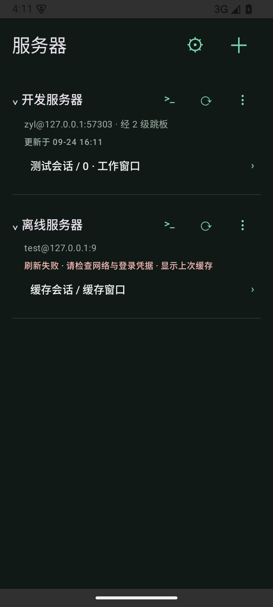
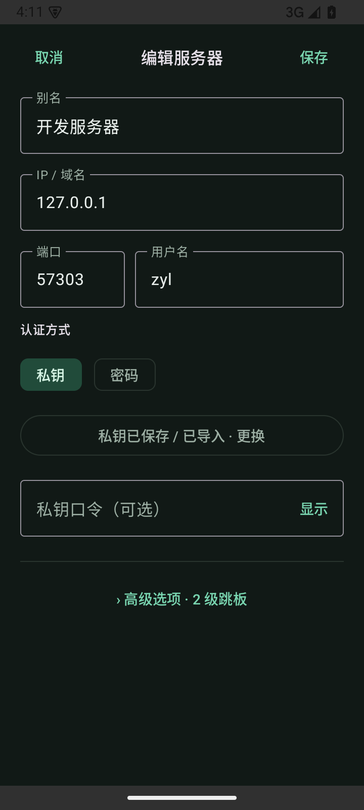
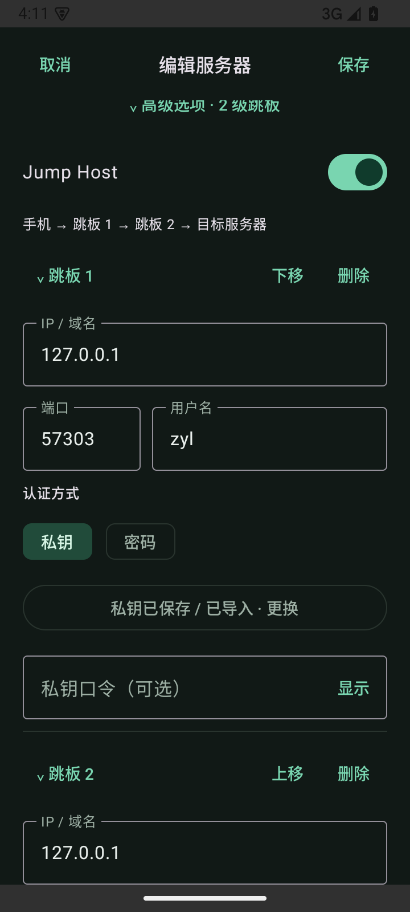
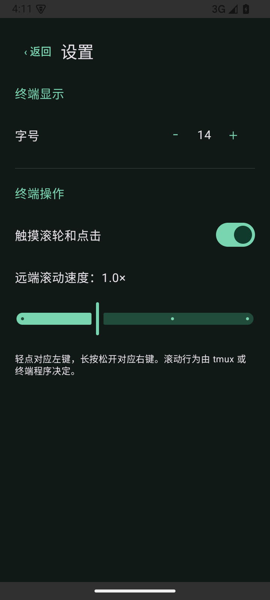

# 0.2.0：服务器首页与多级 SSH 跳板

2026-09-24，versionCode 9。按 [UI 设计](ui-plan.md) 实现：首页、独立服务器编辑页、折叠的高级选项和设置页。终端内部展示继续下一轮迭代。

## 已实现

- 单列服务器，显示别名、地址、上次刷新时间和缓存的会话/窗口名称；多个 pane 的窗口可展开选择。上次使用的目标显示标记，服务器折叠状态持久化。
- 每台服务器右侧 `>_` 开普通 SSH、圆形箭头刷新、更多菜单编辑/删除；顶部设置和添加服务器。
- 启动、返回首页、首页恢复前台时刷新，先显示缓存，最多两台并发；离线/认证失败保留旧列表并显示状态。自动刷新只读元数据，不 attach，不发送输入。指纹待确认时在对应行提示，由用户点击核对。
- 配置保存不依赖网络；保存后关闭窗口。未保存修改退出时确认放弃。支持别名、地址、端口、用户名、密码/私钥及私钥口令。
- 高级默认折叠，包含 Jump Host、tmux 路径和会话鼠标设置。跳板支持多级、各级独立认证、展开/折叠、增删及调整顺序；凭据随稳定的跳板 ID 保存。
- 设置页持久化字号、滚动速度和远端鼠标触控开关，与终端工具设置保持一致。
- 终端返回首页会关闭本应用的交互连接，继续刷新列表；原有回复目标保护、历史滚动与安全重连保留。

## 连接与本机数据

JSch 为各级建立独立 SSH 会话，使用上一跳的回环端口转发访问下一跳；每一级和目标服务器都严格校验主机密钥。主机信任按地址与前置跳板路由区分，相同内网地址经不同跳板不会混用信任记录。失败标明跳板级别或最终目标，关闭整条链路，不回退直连。实现参考 [JSch JumpHosts 官方示例](https://raw.githubusercontent.com/mwiede/jsch/master/examples/JumpHosts.java)。

已有直连配置无需迁移；保持原凭据 AAD 格式。新增跳板凭据与目标凭据一起使用 Android Keystore + AES-GCM 加密，跳板路由参与 AAD；缓存和最近任务也核对路由。路由变更不能读取原密文或复用旧目标，编辑页会用已加载凭据重新加密保存。草稿按连接路由及 pane 身份隔离。

缓存只含任务名称、主机密钥及 tmux 身份，不含终端输出或凭据。修改地址、端口、账号、tmux 路径或跳板链清除该配置的缓存和最近记录；改别名保留。删除配置清除关联凭据、缓存及最近记录，只删除其他配置未引用的各级信任记录。刷新完成前再次编辑或删除时，旧结果不会写回配置。

## 验证

| 检查 | 结果 |
| --- | --- |
| 核心和隔离 OpenSSH 集成 | 15 项通过，0 跳过/失败（6 核心 + 9 SSH） |
| Android 15 模拟器，真实 SSH/tmux fixture | 14 项通过，0 跳过/失败 |
| APK 编译 | `:app:assembleDebug` 通过 |
| Android lint | 0 errors，14 warnings（依赖更新及 SharedPreferences KTX 建议） |

新增 SSH 回归穿过两级跳板，独立验证三次主机校验、明文/带口令 Ed25519 私钥、exec、发现及 PTY 中文输入；错误主机密钥和第二跳认证失败被拒绝，无可用的直连回退。跳板 fixture 使用同一隔离 sshd 的不同链路位置，未连接用户服务器。

新增 Android 回归实际点击首页手动刷新、设置、编辑、高级跳板、保存与返回，验证自动刷新时间推进、离线缓存保留、凭据加密恢复、链路变更失效与共享信任清理；通过两级跳板执行 shell 命令并进入指定 tmux pane。原有显示像素、软键盘、滑动、鼠标 TUI、pane 误投拦截和安全重连回归全部通过。

复现命令见 [README](../README.md)。测试报告位于 `core/build/test-results/test/`、`app/build/outputs/androidTest-results/connected/`、`app/build/reports/lint-results-debug.html`。

## 实际页面截图

以下来自 Android 15 模拟器的合成测试数据，非设计图。测试临时关闭防截图；正式应用保留防截图。

| 首页 | 服务器编辑 |
| --- | --- |
|  |  |

| 高级跳板 | 设置 |
| --- | --- |
|  |  |

## 安装包与待验证项

APK：`app/build/outputs/apk/debug/app-debug.apk`，0.2.0-dev（9），可覆盖本工作区此前的 debug 安装。

SHA-256：`a670ef9ac2007e5b08fdb7ca90fe46074aa886221cea1d34af9f3b8d0f811d7a`

仍需真实手机和不同跳板服务器、密码认证、多级网络中断、实际 Codex/OpenCode/Kiro TUI、小屏/横屏及大量任务列表的体验验收，见 [设备清单](device-checklist.md)。这轮没有修改滚轮行数和 tmux 共享显示尺寸策略；细粒度滚动与终端内部 UI 继续留在计划中。P0/P1 整体验收与发布准备尚未完成。
