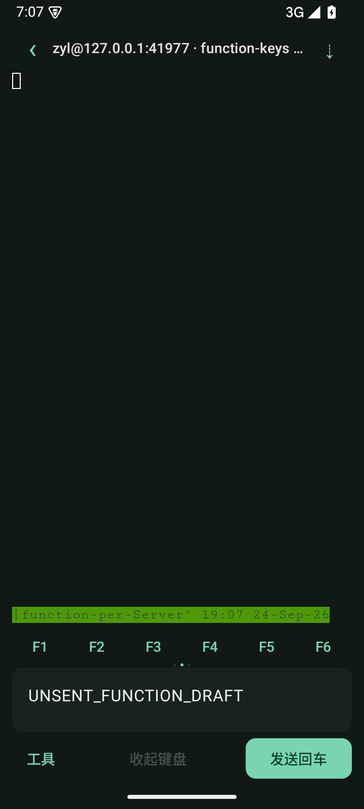
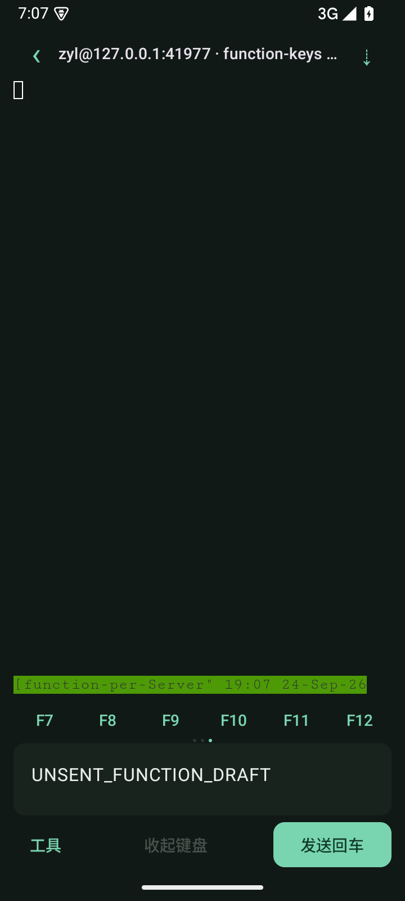

# 0.3.2：快捷键铺满与三页切换

2026-09-24，versionCode 13。

快捷键改成整页横向滑动，每页六个等宽按钮铺满可用宽度，底部三个小圆点标记当前页：

1. Esc、Tab、Ctrl-C、↑、↓、Enter。
2. F1–F6。
3. F7–F12。

保留 40dp 栏高；翻页不改变终端网格或触发按键。功能键采用标准 xterm 序列，沿用 pane 目标保护，不提交手机回复框里的草稿；断线/发送中禁用，Enter 的原有发送语义不变。

## 同轮发现与修复

真实按键字节测试发现 OSC 10/11 颜色查询的回复先于功能键混进了 pane 输入，与 0.3.1 的 DA 回复误投属于同一类问题。本轮增加完整 OSC 10/11/12 `rgb:` 回复白名单（支持 BEL/ST 结尾），返回 tmux 客户端协议层；不放行任意 OSC、查询或附加文本。

## 验证

- Android 15 定向回归 3 项通过：三页按钮宽度和首尾位置、左右翻页、F1–F12 在真实 tmux pane 中的完整 52 字节输入、草稿保持、断线禁用；另含键盘锚点与 pane 目标保护回归。此次未重新运行全部 17 项 Android 用例。
- 核心/隔离 OpenSSH 共 17 项通过，0 失败/跳过；包含颜色回复白名单与普通输入拒绝误分类。
- 最终 APK 编译与 lint 通过：0 errors、15 warnings（依赖更新及 SharedPreferences KTX 建议）。
- 实际截图已检查，按键铺满且不改变底栏高度。真实 Agent 如何处理各功能键，取决于程序自己的绑定。

| F1–F6 | F7–F12 |
| --- | --- |
|  |  |

截图为合成测试数据，未连接用户服务器。

APK：`app/build/outputs/apk/debug/app-debug.apk`，0.3.2-dev（13），可覆盖安装。

SHA-256：`37f4e2a545df240fe9d6ee9524bb8f6b532aa1c189ff399b912c52311379ee78`
