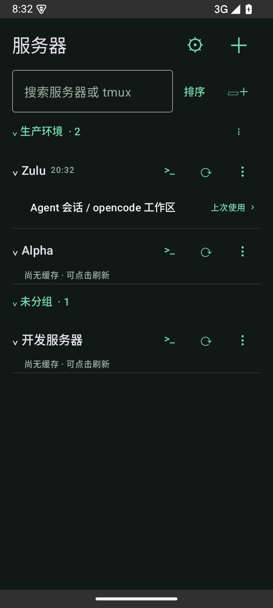
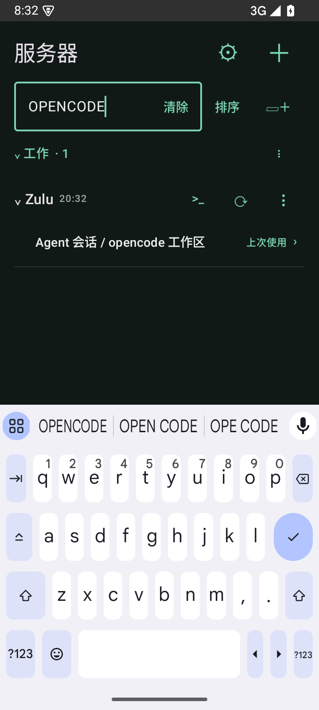

# 0.4.0：服务器文件夹、搜索与排序

2026-09-24，versionCode 14。首页整理能力已实现，沿用已有终端入口及 15 分钟自动嗅探规则。

## 使用方式

- 搜索框右侧“▱＋”新建文件夹；文件夹右侧 `⋮` 重命名或删除，点标题折叠/展开。
- 服务器 `⋮ → 移动到文件夹` 选择目的地，也可移回未分组。新建服务器默认未分组。文件夹为单层本机分组，空文件夹可以保留。
- 删除文件夹将服务器移回未分组，保留配置、加密凭据、主机信任、缓存与最近任务；删除服务器不删除文件夹。
- 排序菜单提供添加顺序、名称、最近使用，跨重启保存。排序作用于各文件夹内；文件夹按创建顺序，未分组最后。名称按设备地区排序，相同排序值保持添加顺序；最近使用指成功进入 SSH/tmux，编辑与刷新不计入。
- 搜索覆盖别名、地址、用户名、文件夹名及缓存的 tmux 会话/窗口名，忽略大小写。搜索只查本机元数据，不额外连接服务器；不搜索凭据或终端正文。
- 搜索临时展开匹配的分组和服务器，清除后恢复折叠状态；仅任务命中时过滤到对应子项，服务器/文件夹名称命中时展示其任务。无匹配时显示提示。

## 数据与兼容

分组采用单独的稳定文件夹 ID 和服务器 ID 关联，未给 SSH 配置、凭据 AAD 或 RecentTask 身份增加字段。旧版本配置无需迁移；移动服务器、改文件夹名和排序不会重新加密凭据，也不改变探测时间或缓存身份。

新增的每服务器最近使用时间只在成功记录进入任务时写入，不受“最近 10 个任务”条数限制；旧配置可从已有最近任务记录回退取得时间。删除服务器清理所属分组与使用时间。

## 验证

Android 15 模拟器 + 隔离 OpenSSH/tmux fixture：完整 **19 项通过，0 失败/跳过**。最终 APK 编译通过；Android lint 为 0 errors、20 warnings（依赖更新及 SharedPreferences KTX 建议）。

新增测试覆盖新建/重命名/删除、移动和移回未分组、空名与重名校验、名称/最近使用顺序、跨 Activity 重建的分组/折叠/排序持久化、隐藏域名与缓存任务搜索、空结果，以及操作前后凭据密文完全一致、任务/缓存保留、探测计时不变。

原有真实 SSH、多级跳板、tmux、键盘锚点、F1–F12、协议回复和安全重连测试一起回归。本轮没有修改核心 SSH 或 Web 终端代码；大量服务器下的性能与不同手机尺寸仍待真机试用。

## 实际页面

以下为 Android 15 模拟器合成数据，非用户服务器。

| 文件夹与排序 | 缓存任务搜索 |
| --- | --- |
|  |  |

## 安装包

`app/build/outputs/apk/debug/app-debug.apk`，0.4.0-dev（14），可覆盖安装。

SHA-256：`b9b3ce6d9c534e873803cae511c92e7780e51f56e750a5217d098a1c3e1b8ce5`
