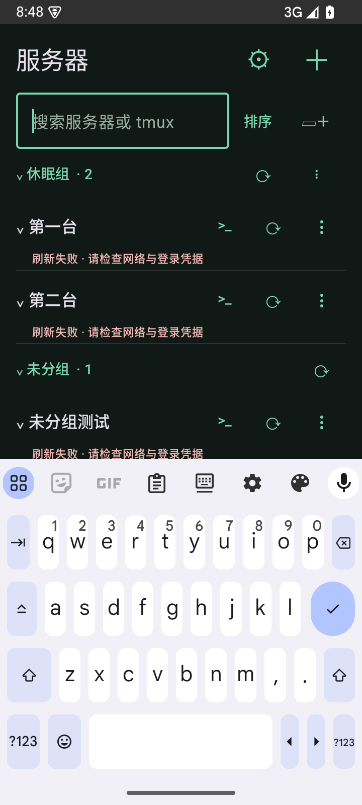

# 0.4.1：首页刷新与文件夹批量刷新

2026-09-24，0.4.1-dev，versionCode 15。

自动嗅探间隔改为每台服务器 30 分钟，失败尝试也计入并跨重启保留。只在冷启动或从后台回到首页时检查；从终端、设置或编辑返回首页不触发，不增加后台定时器。

文件夹展开/折叠状态持久化；折叠文件夹跳过自动刷新。搜索临时展示匹配子项不改变保存状态或刷新资格，展开本身不发起连接。未分组参与自动刷新。

文件夹及未分组标题右侧增加刷新按钮，一次刷新全组，包括搜索隐藏的服务器；手动刷新不受折叠状态及 30 分钟间隔限制。空组按钮禁用，刷新期间显示进度。沿用最多两条并发探测连接、失败保留缓存及逐台主机指纹核对。

## 验证

Android 15 模拟器与隔离 OpenSSH/tmux fixture：20 项通过，0 失败、0 跳过。覆盖 30 分钟边界、折叠状态跨重建保留、冷启动和后台恢复过滤、搜索不解除折叠限制、手动整组刷新覆盖搜索隐藏成员、折叠状态下绕过时间限制、展开不触发连接，以及终端返回首页不刷新。原有终端、键盘、协议回复、多级跳板和安全重连测试全部回归通过。

APK 构建通过；Android lint：0 errors、20 warnings（依赖更新及 SharedPreferences KTX 建议）。本轮未修改核心 SSH 或 Web 终端代码；真实手机体验待覆盖安装验证。

截图使用本机合成离线服务器，刷新错误提示是测试预期。

## 安装包

`app/build/outputs/apk/debug/app-debug.apk`，可覆盖安装。

SHA-256：`2ab807e6c1acc94eb976d469b43fc51f92bdc0d518c598800a25c80445cb497e`
