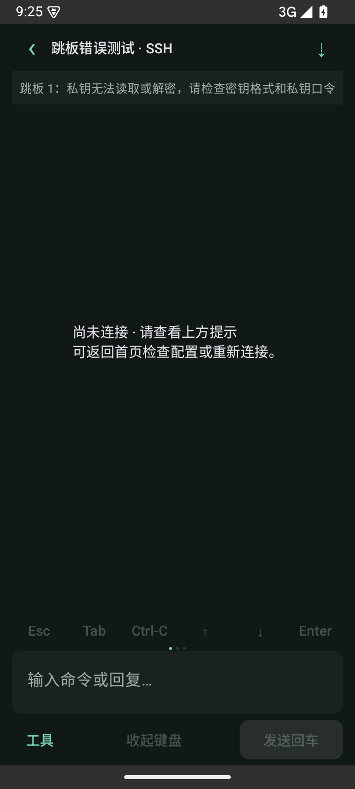

# 0.5.0：手机选区复制与连接提示

2026-09-24，versionCode 16。

## 使用方式

终端“工具 → 选择复制”打开已加载文字的静态副本，长按选词，拖动系统选区手柄后使用系统复制菜单；顶部也可复制全部。返回后继续操作原终端。该页面不产生远端点击、按键或命令，持续输出不改变已打开的副本。

内容来自当前活动缓冲区，包括本机已有历史；自动换行拼回原行，保留真正换行、中文与 Emoji。最多保留最近 20 万字符，截断时显示提示。tmux 的其他历史并未全部下载，需要回到终端滚到对应位置后重新打开复制页。文字只保留在内存，用户主动复制时才写入系统剪贴板。

## 连接提示

首页探测行和终端显示目标服务器或跳板序号，以及准备认证、连接并验证身份、读取/核对 tmux 的阶段。SSH 握手中的网络和认证作为一个阶段，不显示虚假的精确进度。

错误区分域名/DNS、拒绝连接、网络不可达、超时、认证失败、私钥读取/解密、转发和算法兼容问题。tmux 路径、权限及目标变化沿用应用内明确提示。错误分类检查嵌套原因，显示固定建议，不展示 SSH 库原始异常、私钥或密码。主机密钥核对仍单独处理，不绕过信任校验。

经跳板转发的连接故障可能同时涉及下一台服务器可达性和转发权限，提示提供检查方向，不将推断当成服务端已确认原因。

## 验证

- Android 15 模拟器完整 22 项回归通过，0 失败/跳过；随后加强的原生选区手柄专项另行通过。
- 核心 19 项测试（含隔离 OpenSSH/tmux 集成）全部通过，0 失败/跳过。
- 4 项终端解析测试与实际 Chromium 页面测试通过；覆盖中文/Emoji、自动换行拼接、独立全屏缓冲、长度限制及复制不发送输入。
- Android 回归验证真实触摸长按、两端原生选区手柄、选区复制和复制全部的实际剪贴板内容、新输出不修改副本、原终端保留新输出，以及目标服务器认证失败和跳板私钥错误不泄漏凭据。

真实手机上不同系统的选区手柄、跨行拖选、长文本和输入法仍需按真机清单复测。模拟器用本地合成内容及隔离 SSH/tmux fixture，不使用用户服务器或凭据。

## 下一轮

按用户最新优先级，接着推进 Agent 状态卡、快捷回复和语音入口。三项尚未实现：状态不确定时显示“未知”，快捷回复和语音结果先进入可编辑草稿，用户确认发送后再按当前 pane 身份校验投递。逐行滚动、独立显示、密钥生成及其他扩展后移。

APK 构建通过，Android lint 为 0 errors、20 warnings（依赖更新及 SharedPreferences KTX 建议）。

## 安装包

`app/build/outputs/apk/debug/app-debug.apk`，0.5.0-dev（16），可覆盖安装。

SHA-256：`a988d03ff69ef153d1d507f7e548acc211a8d6c634283d7b6fb0c233a4b2c946`
