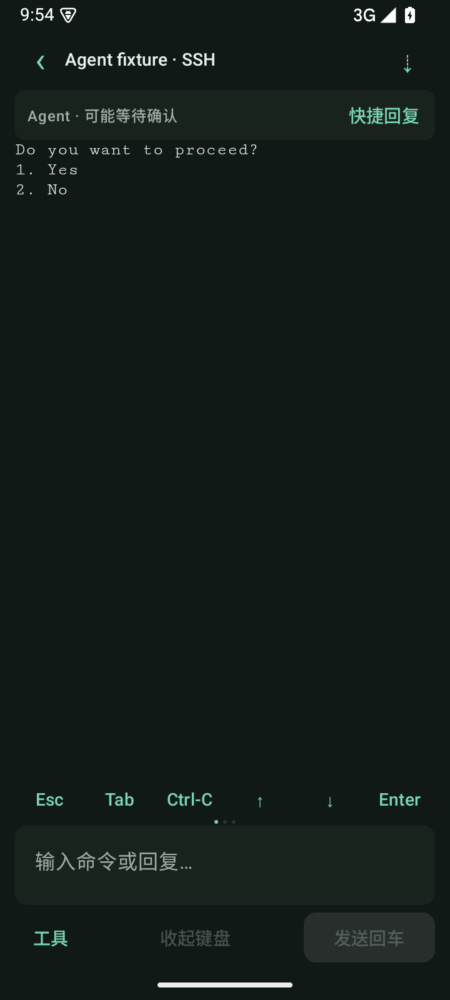
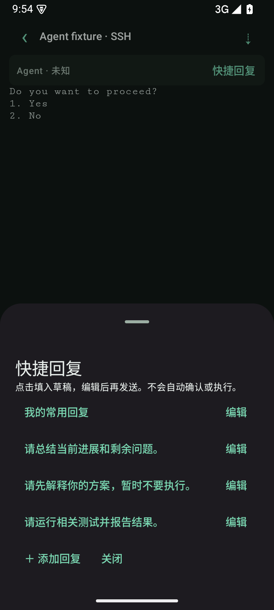
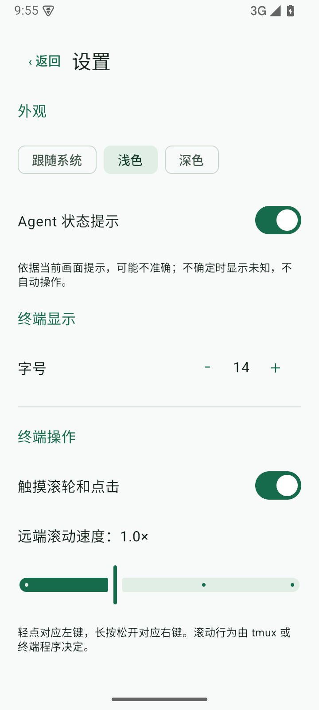
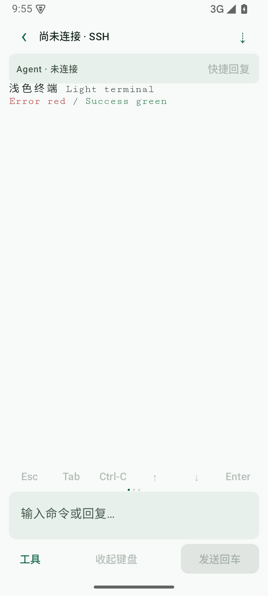

# 0.6.0：Agent 状态卡、快捷回复与主题

2026-09-24，versionCode 17。

## Agent 状态卡

终端标题下增加固定高度的紧凑提示卡。显示“未知 / 可能等待确认 / 发现错误提示”，断线单独显示未连接；点击左侧可查看当前文字依据。首页设置可以关闭提示卡，工具中仍保留快捷回复入口。

卡片只在连接且终端可见时检查本机已经收到的画面，至多约每 1.2 秒检查一次，内容没变化时不重复提取；不额外请求服务器，不保存正文，不判断任务完成、正在思考或卡死。连接切换时清除旧提示；本机历史阅读期间不把旧输出当作当前状态。

这是通用文字提示的首版，确认/错误样本为合成测试，不是完整的 Codex CLI、OpenCode 或 Kiro CLI 状态协议适配。代码示例、远端历史和各类 TUI 格式可能造成误判，尤其不能完整识别所有 tmux copy-mode；应核对原始画面，任何提示都不会触发自动操作。

## 快捷回复

从状态卡右侧或“工具 → 快捷回复”打开。点击回复先填入草稿；已有草稿时明确选择追加、替换或取消。填入时核对当前连接代际，断线后拒绝填入；发送仍需用户操作，继续沿用目标 pane 校验与多行预览。

支持添加、编辑、删除，本机保存；最多 12 条，每条 1000 字。默认提供“继续”、总结进展、先解释方案和运行测试等常用文本，没有自动批准按钮。快捷回复本质上是本地模板，不用于保存密码或私钥。

## 深色、浅色与跟随系统

首页设置新增三种外观模式，默认沿用深色，选择跨重启保留。浅色使用浅灰绿背景、深色正文、深绿操作/图标和深红错误提示；配套调整输入框、卡片、菜单、弹窗和原生复制页。

终端同步调整默认文字、光标、选区及 ANSI 调色板，启用 xterm 4.5 最低文字对比度。远端硬编码的背景或真彩色仍由终端程序控制，无法承诺每种 TUI 都不用自身主题设置。主题切换不清屏、不改变网格/阅读位置；系统明暗变化不重建 Activity 或 SSH 连接。系统栏背景和图标同时适配。

同时修复终端启动阶段的指令时序：页面就绪前将初始化/连接指令排队，避免脚本尚未加载时执行而导致断开。

## 验证

- Android 15 模拟器完整 **24 项通过，0 失败/跳过**，包括确认/错误/未知状态、依据查看、快捷回复编辑持久化、追加/替换及断线拦截，三种主题、跨重启保存、系统明暗切换不重建 Activity 和原生复制页颜色。
- 核心 **20 项通过，0 失败/跳过**，包含状态判定边界、历史/旧提示抑制和隔离 OpenSSH/tmux 集成。
- 4 项终端解析测试及 Chromium 实际页面测试通过：主题切换不改变文字、网格、视口或连接 token，不发出输入；检查浅色默认颜色、最低对比度及历史读取标识。
- APK 构建通过；Android lint 为 0 errors、23 warnings（依赖更新、KTX 使用建议）。

截图为合成测试内容，不包含用户服务器数据。

| 状态提示 | 快捷回复 |
| --- | --- |
|  |  |

| 浅色设置 | 浅色终端 |
| --- | --- |
|  |  |

不同真机的主题、输入法以及各 Agent 实际提示仍需按真机清单试用。

## 后续

独立语音入口仍未实现，保持下一项优先工作；逐行滚动、独立显示、设备密钥生成和其他扩展继续后移。

## 安装包

`app/build/outputs/apk/debug/app-debug.apk`，0.6.0-dev（17），可覆盖安装。

SHA-256：`ec6627af224ecbe5dc19dfa2ccd603dbf92247fb2472a7a607ea665c739a327c`
