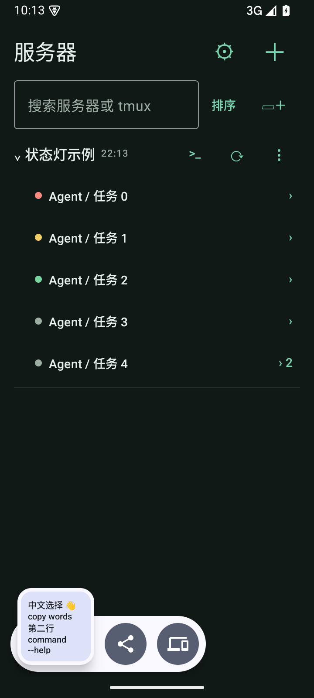
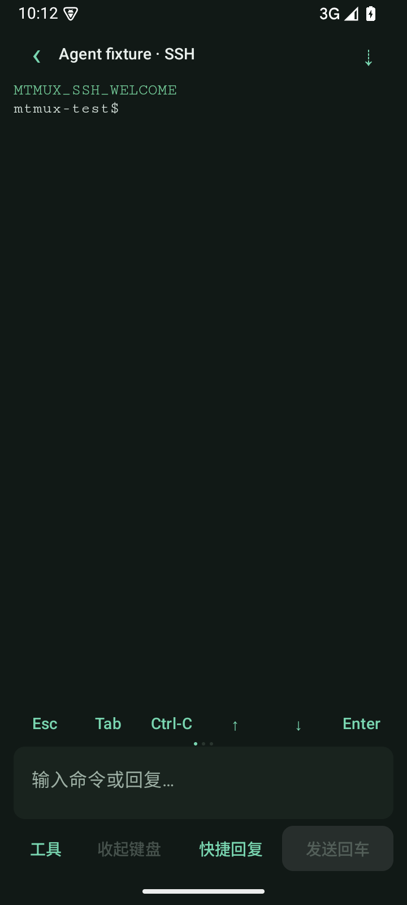

# 0.6.1：首页任务状态灯与底部快捷回复

2026-09-24，versionCode 18。本版按用户反馈替换 0.6.0 的终端 Agent 卡片。

## 首页状态灯

每个 tmux 名称前只放一个小圆点：红色可能需要回答或处理，黄色正在运行，绿色正常完成；灰色表示无法判断、缓存过期或刷新失败。深浅主题分别配色，无障碍描述提供文字含义，设置页显示图例。

多 pane 窗口先看是否有红色，其次黄色；有未知成员时不能显示全部完成，全部明确完成才显示绿色。展开后各 pane 有自己的状态点。

颜色来自上次刷新时的当前 pane 画面，**不是实时状态或 Agent 内部状态**。例如明确的确认/错误提示判红，Thinking/Working 或中断操作提示判黄，Task completed、Worked for 等明确结束文字判绿。不根据没有输出、进程存在或普通 shell 提示符猜测完成。不同 Agent 版本、代码示例和历史画面仍可能误判，未覆盖的格式显示灰色。

## 刷新与数据

随现有列表刷新，通过 SSH 读取每个目标的当前画面并核对完整 pane 身份。不 attach、不切换焦点、不改变 copy-mode、不发送操作；状态读取失败为未知。缓存只新增状态枚举，不保存终端正文，旧缓存自然显示灰色。

继续保持外部进入首页、30 分钟间隔、折叠文件夹跳过、服务器/文件夹手动刷新规则。从终端返回仍不自动刷新。没有新增网络轮询；前台首页每分钟仅在本机检查过期颜色，超过 30 分钟置灰。刷新失败保留名称和任务缓存，同时清除旧颜色，跨重启仍为未知。

## 终端底栏

撤掉终端 Agent 卡片、依据弹窗及本地终端状态轮询，恢复终端空间。底部依次为：

`工具  |  收起键盘  |  快捷回复  |  发送回车`

按比例分配宽度，保持单行。快捷回复保留新增/编辑/删除、草稿追加/替换/取消、断线拦截及显式发送规则，移除原先工具里的重复入口。

## 验证

- Android 15 模拟器完整 **26 项通过，0 失败/跳过**。覆盖状态枚举持久化、30 分钟过期、多 pane 汇总、刷新失败后跨重启仍灰、真实 tmux 按身份只读采集、不改变焦点/copy-mode、已变化身份不继承颜色、缓存不含正文、底栏位置、草稿和断线保护。
- 核心 **20 项通过，0 失败/跳过**，含判定边界、状态汇总和隔离 OpenSSH/tmux 集成。
- 4 项终端解析及 Chromium 实际页面测试通过；APK 构建通过，Android lint 为 0 errors、24 warnings（依赖更新及 KTX 建议）。

| 首页状态灯 | 底部快捷回复 |
| --- | --- |
|  |  |

截图使用合成任务/本地测试服务器；系统剪贴板浮层若出现，来自相邻复制测试。真实 Codex CLI / OpenCode / Kiro CLI 各版本的提示覆盖仍待真机试用，不承诺启发式颜色完全准确。

## 安装包

`app/build/outputs/apk/debug/app-debug.apk`，0.6.1-dev（18），可覆盖安装。

SHA-256：`fc5df1f294724a9a929504edb27c527167db8ba79ec6a23e4f65c4982bfbb326`
