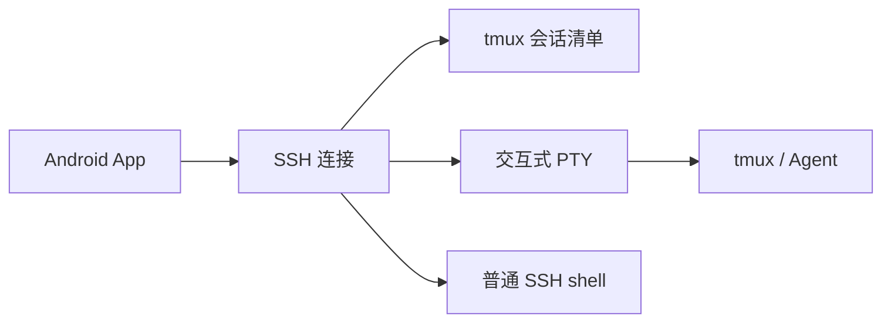

# Android SSH + tmux Agent 控制端：开发计划

> 版本：2026-09-25。目标是做一款可发布到 Google Play 的 Android App：在手机可以访问服务器的前提下，用户配置 SSH 登录信息，App 即可列出该账号可访问的 tmux 会话，并可直接进入 SSH 终端；从手机查看和回复远程 Agent，支持通过系统输入法进行语音输入。

**当前进度（2026-09-24）**：已交付 0.6.5-dev（日志滚动上限扩大至 10 MiB；私钥粘贴导入、限量日志生成与清空；补齐 Codex 输入提示与模型栏识别；状态灯标题/CLI 识别、批量采集与立即显色修复；首页 tmux 红黄绿状态灯，撤下终端状态卡；底部快捷回复与三种主题；保留 0.5.0-dev 的手机选区复制、连接阶段与分类错误提示；保留 0.4.1-dev 的 30 分钟外部进入刷新、折叠组跳过与文件夹批量刷新；服务器文件夹、搜索与排序；三页等宽快捷键，新增 F1–F12；修复 DA 设备属性回复误投到 pane；终端沉浸布局与键盘锚点保持；保留首页自动嗅探至少间隔 30 分钟、别名优先和同行更新时间；服务器列表与缓存刷新、独立编辑/设置页、多级 SSH 跳板；保留最近任务持久化、一键核对后重连、目标变化拒绝接入、不重放输入；保留 pane 投递保护）；前版已实现断开反馈、tmux 名称与历史快照，详见 [最近任务与重连](docs/p1-014.md)、[回复目标修复](docs/p1-013.md)、[滚动修复](docs/p1-012.md) 与 [凭据/触控交付](docs/p1-011.md)。此前已实现 P0 Android 技术验证原型并通过本地编译、核心/SSH/tmux/终端自动化测试。Android 15 模拟器显示与 SSH 端到端回归已通过；用户覆盖安装 0.0.3 后初步反馈终端可以显示，但发现断开反馈、配置保存、tmux 名称与历史滚动问题。真实 Agent TUI 和完整真机清单仍待验证，P0 未整体验收；构建与使用见 [README](README.md)，证据与限制见 [P0 报告](docs/p0-report.md)，手机测试见 [真机清单](docs/device-checklist.md)。原型采用共享 session attach，回复目标保护已实现，独立显示焦点与尺寸仍待设计。

本轮 UI 草案见 [首页与服务器配置设计](docs/ui-plan.md)：启动显示服务器单列及缓存 tmux 子项，冷启动或从后台回到首页时，对展开文件夹及未分组中距上次嗅探至少 30 分钟的服务器自动刷新、各服务器右侧提供 SSH 小按钮和手动刷新，右上角设置/添加，独立服务器表单，Jump Host 收入默认折叠的高级选项。按用户最新要求，多级 Jump Host 纳入本轮范围；已在 0.2.0 实现，见 [UI 交付与验证](docs/ui-020.md)。终端布局已于 0.3.0 优化；0.4.0 补齐文件夹、搜索与排序。

**2026-09-25 下一阶段评估（仅计划）**：新增 [语音输入、中英文界面与云同步评估](docs/next-phase-plan.md)。优先顺序建议为双语资源化 → 系统识别语音入口 → 可移植加密备份 → GitHub 双向同步；WebDAV 是后续优先替代后端。云同步纳入后续优先队列，覆盖旧章节“跨设备同步暂缓”的排期，不表示已实现。原计划设备密钥生成、手动目标、独立显示、弱网及发布验收仍未完成，继续暂缓。

## 1. 产品边界

**目标用户与核心价值**：为已经在远程服务器上使用 tmux 跑 Agent 的开发者，提供离开电脑后的快速查看和回复入口。首版围绕一条完整流程设计：**打开 App → 回到最近任务 → 看懂最新输出 → 回复 → 离开**。

核心场景：服务器上已经通过 tmux 运行 Codex、Claude Code、OpenCode 或普通命令；手机随时连接，查看会话、进入终端、回复 Agent。App 断线或退出不会主动结束远端 tmux 和其中的 Agent；电脑端仍可使用普通 SSH + tmux 访问相同会话。普通 SSH shell 不提供同等的任务持久性保证，直接连接页面须说明这一差异。

- **首次使用**：添加服务器，填写名称、地址、端口（默认 22）、SSH 用户名；选择密码或 SSH 密钥认证，验证并确认服务器主机密钥。
- **服务器首页**：连接后自动检查 `tmux`，列出当前 SSH 用户有权限访问的 session；展开显示 window 和 pane，保留最近选中的入口，能手动刷新、搜索和排序。
- **进入方式**：点列表中的 session/window/pane 进入交互式终端；也可点「直接连接」进入普通 SSH shell，在其中自己输入命令。另提供手动输入 tmux 目标的入口，供自动发现不符合预期时使用。
- **Agent 使用**：看原始 TUI 和滚动内容；快速发送文字、Enter、Esc、Ctrl-C 等常用按键；可用语音转文字填写输入框，先预览再发送。
- **状态卡片**：后续辅助识别需要回复、capacity 错误和连接中断；始终允许打开原始终端确认。所有无法确定的情况显示「未知」，不把长期无输出直接当成卡死。

**发现范围**：tmux 管理的是 session → window → pane。SSH 登录后，普通 `tmux list-sessions` 只能列出该 Unix 用户默认 tmux socket 中可访问的会话；它不能扫描整台机器上其他用户的 tmux，也不能自动识别 screen、普通后台进程或任意自定义 socket。特殊 socket 可以在后续版本增加显式配置。首版要求服务器已安装 tmux，且 Agent 原本就在 tmux 中运行；App 不在服务器安装常驻服务。

### 产品价值验证

邀请 3–5 位已经使用 SSH + tmux 运行 Agent 的开发者，先观察其现有手机操作流程，再试用 P1 一周。记录首次连接的阻碍、回到原任务所需步骤、查看输出并回复的完成情况、重复使用天数和误操作；无需上传终端内容，可通过访谈和用户主动提供的脱敏记录收集反馈。

初始验证目标：完成配置后从首页一两步回到最近任务；试用者能独立完成查看和回复，并在一周内多次主动使用。对照原有流程确认自动发现和输入框是否减少操作。若主要阻碍仍是阅读或输入，优先改进这些环节，再投入状态识别；记录样本和失败原因，不把小样本结果视为市场验证完成。

### 首次连接与兼容范围

首次连接按“网络可达 → SSH 认证与主机密钥确认 → tmux 检查 → 会话发现”逐步展示结果。私网服务器需要用户先建立可用的 VPN 或其他网络连接；App 首版不代建网络通道。错误提示应区分网络不可达、配置错误和暂不支持的能力。

| 项目 | 首版范围与 P0 交付要求 |
| --- | --- |
| 服务端系统与 tmux | 优先验证实际使用的 Linux 服务器；P0 记录发行版、shell、tmux 版本，并确定最低支持版本；未测试的平台不承诺兼容 |
| Android | P0 根据组件与真机验证确定最低 Android 版本，并与发布所需 target API 分开记录 |
| 认证与密钥 | 支持密码、设备生成专用密钥和导入密钥；P0 列出验证通过的算法、私钥格式及加密私钥支持情况，未支持的格式提供明确提示 |
| 跳板机与 SSH config | 0.2.0 已支持多级 SSH 跳板、各级认证与主机校验；自动导入 SSH config 仍暂缓 |
| tmux socket | 首版自动发现默认 socket；自定义 socket 暂缓，手动输入目标不代表支持其他 socket |
| tmux 路径 | 检查非交互式 SSH 环境中的可执行路径；找不到时提示“未安装或不在 PATH”，允许配置 tmux 可执行文件绝对路径并安全处理参数 |

P0 结束时将待确认项填写为实际测试结果；未达到首版目标的能力须明确调整范围，不保留未经验证的兼容性承诺。

## 2. 交互与技术架构

首选原生 Android（Kotlin + Jetpack Compose）。SSH、终端渲染分别选用维护状态和许可证适合上架的现成库；在确定库之前做一个小型验证：用真实 Android 设备连接服务器，测试 SSH 密钥、交互式 PTY、窗口尺寸调整、UTF-8 中文、ANSI 颜色、鼠标/触摸、复制粘贴，以及 Codex 和 OpenCode 的实际 TUI。不要自行实现 SSH 协议或 VT/xterm 解析器。

连接分两类：短连接执行 `tmux list-sessions`、`list-windows`、`list-panes` 等发现命令；独立交互式 SSH PTY 执行 `tmux attach-session -t <session>`。**多客户端尽量互不干扰是待验证的设计目标，不能假定先选择 window/pane 再 attach 就能隔离状态**。tmux 的 session/window 存在共享状态，窗口尺寸也有独立管理规则；P0 必须验证后确定接入、焦点和尺寸策略，记录最低版本要求及无法隔离的行为。禁止默认使用会踢掉其他客户端的 attach 选项，也不得静默修改用户全局 tmux 配置。终端尺寸变化时向 SSH PTY 发送 resize；网络中断后重建 SSH 并重新 attach，不假设原连接可以恢复。

服务端命令输出使用 tmux 的可自定义格式并按字段解析，尽量使用稳定 ID（如 session/window/pane ID），展示时用人类可读名称。发现命令是固定参数模板，所有用户提供的目标通过安全参数处理或可靠的 shell quoting，不能直接拼成任意远端 shell 指令。发现失败要区分：SSH 失败、主机密钥改变、tmux 未安装、没有会话、权限不足和 tmux socket 异常。

### 手机阅读与输入

- P1 提供字号调整、历史滚动、复制粘贴和常用按键栏；验证 tmux 历史与终端本地滚动的配合，避免手势误触发 Agent 操作。大量输出时仍能阅读和输入，并能回到最新输出。
- 提供独立多行输入框，支持中文输入法组合输入、编辑和系统输入法语音转写；未完成的拼音组合不得提前发送到远端。
- 明确区分“粘贴文本”和“发送 Enter”；粘贴不额外附加提交按键，多行内容先预览。P0 验证 bracketed paste 及目标 TUI 的实际行为，不把所有终端程序都视为支持安全多行粘贴。
- 草稿按服务器、socket 和目标 pane 隔离；切换目标、旋转屏幕及短暂退后台后保留未提交内容，首版不承诺进程被系统终止后恢复。若未来落盘保存，须明确加密、清理和删除规则。
- 始终显示服务器及当前目标。鼠标操作作用于所见终端；回复与键盘输入绑定明确选择的 pane，发送前核对。目标变化或无法确认时暂停发送并提示用户重新选择，不能静默投递到其他 pane。

### 断线与发送结果

- 断线后停止发送，保留尚未提交的草稿；不排队自动补发。
- 已尝试发送但无法确认结果的文本或按键显示“发送结果不确定”，提示检查远端输出；不得把 SSH 写入成功等同于 Agent 已接收或执行。
- 重连后不自动重放文本、Enter、快捷按键或多行粘贴。用户检查后可明确选择重新发送。
- 重连后重新发现并核对原目标；pane 消失时停止操作，不自动转到其他 pane。tmux 服务重启后不能仅凭复用的 ID 认定是原任务，身份无法确认时重新选择目标。
- 手机退出只断开自身连接，不发送 exit、Ctrl-C 或终止 tmux 的命令。普通 SSH shell 的进程行为由远端环境决定，不适用 tmux 内任务的持久性承诺。

### P0 多客户端验证矩阵

| 场景 | 必须验证并确定的行为 |
| --- | --- |
| 手机进入电脑正在使用的 session | 是否改变电脑端窗口或焦点；记录共用状态及选定接入策略 |
| 手机弹出键盘或旋转屏幕 | 远端 TUI 是否重排、电脑端是否受影响；确定尺寸策略 |
| 电脑切换 pane，手机正在写回复 | 草稿目标不随之静默改变；输入框发送必须到达明确选定的目标，无法保证则阻止发送 |
| 手机退出或网络断开 | 仅手机连接结束，tmux 内任务继续；电脑端保持可用 |

以上结果是进入 P1 的架构依据；若存在无法避免的共享行为，须在产品内明确说明，不能宣称完全隔离。

### 登录信息与安全

- SSH 主机密钥采用首次连接确认并保存指纹的方式；指纹变化时明确拦截并由用户核对。不得默认关闭校验。
- 优先支持从设备生成专用 SSH 密钥并展示公钥；也支持导入已有密钥和密码登录。私钥或保存的密码加密存储，密钥材料不得写入日志、剪贴板或崩溃报告。对导入密钥是否能直接留在 Android Keystore 中使用，需按具体密钥算法和 SSH 库验证；不能假定所有 OpenSSH 私钥都可无损导入 Keystore。
- 本地服务器资料可删除，删除时同时移除关联的本地凭据与信任记录；不做默认云同步或账号系统。手机锁屏后敏感界面的遮蔽、剪贴板行为和生物识别解锁可按实际使用需求加入。
- 自动发现读取 tmux 元数据及用于状态判断的当前 pane 画面，仅保存状态枚举，不保存正文。发送按键、粘贴或语音文本前让用户明确看到目标 pane；多行文本采用终端安全的粘贴路径并预览，避免把特殊字符误解释成 tmux 控制命令。

## 3. 分阶段实施与验收

| 阶段 | 实现内容 | 完成标准 |
| --- | --- | --- |
| P0 技术验证 | 选定 SSH 和终端组件；验证认证、中文输入、Agent TUI、滚动粘贴、多客户端、尺寸和断线发送；审查许可证，填写兼容表 | 通过多客户端验证矩阵，确定目标投递与尺寸策略；列出组件、版本、兼容结果和已知限制；确认不存在阻碍上架的依赖 |
| P1 完整流程 MVP | 服务器配置与主机密钥确认；发现与刷新 session/window/pane；直接 shell；最近任务入口；字号、滚动、复制粘贴、按键栏、多行输入和草稿隔离；连接状态、错误提示与安全重连 | 在网络可达且配置受支持的条件下，完成发现、阅读、回复、离开的完整流程；通过下方关键验收场景；无会话也能进入 shell |
| P2 日常试用与完善 | 连续一周真实试用；修复高频故障；完善多服务器列表、搜索和排序；优化弱网、退后台返回及大量输出体验 | 记录试用流程完成情况、重复使用和失败原因；修复阻碍阅读或回复的问题，检查是否比原有操作流程更方便 |
| P3 按反馈扩展 | 根据试用结果选择 Agent 状态识别或独立语音入口；状态识别可包含 capture-pane 快照、明确错误与确认提示、快捷回复 | 状态无法判断时显示「未知」，保留原始终端，不静默发送 continue 或授权；语音转写可编辑，失败可退回键盘 |
| 发布准备（并行） | 从 P0 起确认开发者账号与测试资格、招募测试者；随实现准备隔离演示环境、隐私说明、商店材料和测试轨道 | 达到日常使用质量并完成真机测试及 Play Console 所需材料；发布不以完成所有 P3 功能为前提 |

**P1 就是第一个真正可用的 MVP**，必须包含读懂输出和完成回复所需的基本体验。P3 由试用反馈决定优先级，不能为了状态灯推迟可靠连接、阅读和输入。P1 先验证系统输入法的语音输入；若确有需求，P3 再增加独立识别入口。具体识别服务可能联网处理音频，不承诺默认离线。若使用 `SpeechRecognizer` 直接录音，需要处理 `RECORD_AUDIO` 权限；若只使用系统输入法麦克风，需按最终实现确认权限和数据流。

### 首轮手机反馈与 P1 首批任务（2026-09-23）

0.0.3 用户初步确认终端能显示。下列范围已在 0.1.1-dev 进一步修正并验证；本地与 Android 证据见 [本次交付](docs/p1-011.md)，不代表整个 P1 已完成。历史滚动的组件可行性仍须在 P0 收尾验证，不能仅把阅读障碍推迟到后续阶段。

| 顺序 | 问题与计划行为 | 验收与回归 |
| --- | --- | --- |
| 1 | 断开后画面像仍在连接：手动断开默认清空当前终端并显示明确的断开占位，远端输入与发送禁用，本地草稿可继续编辑；意外断线保留最后输出并醒目标记“已断开，以下为历史内容”，便于核对执行结果 | 手动断开、远端关闭、网络中断分别验证；旧连接迟到的输出不得重新填入已清空的窗口；仅关闭手机连接，不向远端发送退出或清屏指令，不销毁 tmux 任务 |
| 2 | 每次重填配置：保存服务器资料与本机加密凭据，支持编辑、删除和直接连接 | 杀进程并重启后非敏感配置仍可用；多服务器互不覆盖；0.1.1 按用户反馈将密码、私钥和口令加密保存在本机，下次直接连接；旧配置需补充保存一次，删除配置同时删除密文 |
| 3 | 发现列表只有代号：按 session 名称分组，展示 window 索引与名称、pane 标识；保留稳定 ID 作为内部目标与辅助信息 | 测试中文、空格、引号、分隔符、重复名称与改名；名称不得破坏元数据解析或参与未转义命令；仍按 session 接入时明确显示接入范围，不把 window 行伪装成独立 pane 入口 |
| 4 | 手指无法翻历史：实时终端滑动映射滚轮、轻点映射左键、长按松开映射右键，沿用用户 tmux 绑定并支持传入鼠标 TUI；普通 shell 保留本地 scrollback，快照仅作为辅助入口 | 手机实际滑动查看超出一屏的已知编号输出，并读取 attach 之前的 tmux 历史；分别验证 mouse 开/关和常用 TUI；阅读时新输出不强制跳底，退出阅读恢复输入；不静默修改全局 tmux 配置，验证共享 copy-mode 对电脑端的影响 |

执行顺序：先验证滚动方案是否适合现有终端组件，再依次交付断开反馈、非敏感配置保存、可读名称、完整历史阅读。各项随实现补 README 与针对行为的回归测试；仍保留 P1 的目标投递/共享焦点架构门槛。0.1.1 根据用户明确反馈改为直接交互：滚轮可进入 tmux copy-mode，点击可改变当前 pane，与电脑端操作同样共享状态；只读快照保留为辅助入口。用户实际配置见本次测试报告。

### 后续滚动优化：逐行阅读与节省资源模式（已排期，尚未实现）

用户反馈 0.1.2 已能连续拖动，但仍以五行为单位跳动。本轮只记录计划，暂不修改滚动代码或服务器配置。

- **精细阅读模式**：目标是在 tmux 历史中按一行推进；慢拖、小幅反向和持续输出时均可细读。当前“滚动速度”调整的是滚轮事件频率，不是远端每个事件移动的行数，不能靠调低速度实现一行步进。
- **节省资源备用模式**：保留五行步进，配合事件合并与刷新节流，作为弱网或较低性能设备的可选模式；设置在本机保存。低 CPU / 低网络消耗是待测目标，不把五行步进本身当作已证明的节省效果。
- **协议与隔离**：tmux 3.4 的 copy-mode 和 copy-mode-vi 默认滚轮绑定为 `send -N5 -X scroll-up/scroll-down`（[官方源码](https://github.com/tmux/tmux/blob/3.4/key-bindings.c)）；可通过改变重复次数实现逐行，但直接修改共享绑定会影响电脑端。实现前明确手机侧隔离方案，不静默改全局绑定。Agent 自己处理鼠标的 TUI 须单独验证，不能承诺修改 tmux copy-mode 就能让所有 Agent 一行滚动。
- **验收**：编号历史验证每次最小步进为一行/五行；测试慢拖、反向、松手、新输出及电脑同时 attach；对相同历史距离和输出负载记录手机/服务器 CPU、传输字节、绘制次数与响应延迟，再决定默认模式和节流参数。分别记录 Codex CLI、OpenCode、Kiro CLI 的实测版本。

### 0.2.0 功能缺口核对

以下区分未实现功能与已有功能的验收缺口，不将计划描述当作已交付承诺。

| 阶段 | 尚未完成 | 当前基础与缺口 |
| --- | --- | --- |
| P1 核心 | 多客户端独立焦点/尺寸策略 | 已按 pane 身份隔离草稿，回复/快捷键核对目标并定向发送，焦点改变时拦截；首页已提供 window/pane 选择并核对身份接入；仍按 session attach，共享显示焦点和尺寸 |
| 本轮已完成 | 最近任务直达与安全重连 | 最近 10 个任务落盘，引用本机凭据；显式点击后核对主机密钥和服务/pane 身份，回到原窗口；任务消失或重建时拒绝并要求重新选择。后台返回与断线均需点击重连，旧输入不自动发送；shell 开新连接 |
| P1 | 手动输入 tmux 目标 | 当前从缓存/发现结果选择 window/pane；没有计划中的手动目标入口 |
| P1 | 设备生成专用 SSH 密钥并展示公钥 | 已支持密码与导入私钥、加密保存；未实现设备内生成 |
| 本轮实现 | 手机选区与复制体验、连接提示 | 独立静态文字页使用 Android 原生长按与选区手柄复制；连接阶段及目标/跳板错误分类；验证见 [0.5.0](docs/ui-050.md) |
| 后续阅读优化 | 一行精细滚动、五行节省资源模式 | 见上节；当前只调滚轮频率，仍沿用服务器绑定 |
| P2 | 弱网和大量输出优化、一周日常试用 | 多服务器、文件夹及本机搜索/排序已实现；系统性性能/试用验收未完成 |
| 本轮实现 / 后续优先 | Agent 状态卡片、快捷回复；独立语音入口 | 0.6.1 改为首页名称前的缓存状态灯与底部可编辑快捷回复，真实 Agent 各版本尚待验证；独立语音入口仍未实现，继续优先 |
| 发布准备 | 发布签名与渠道、商店材料、隐私披露、审核演示环境与测试轨道 | 当前为 debug 原型，尚未形成可发布交付 |

仍需补验收：实际 Codex CLI / OpenCode / Kiro CLI、中文与系统语音输入、多客户端、弱网与 Wi-Fi/蜂窝切换、后台返回、大量输出、不同 Android/屏幕及最低支持版本。已有断开禁发、发送结果不确定提示和不自动重放机制，不应将其列为完全未实现。

pane 目标保护已在 0.1.3 修复，最近任务与安全重连在 0.1.4 完成。根据用户 2026-09-24 的优先级调整，**下一阶段集中优化展示逻辑和 UI**，包括入口层级、连接状态、任务信息与终端空间；先围绕实际使用反馈设计。选择/复制、密钥生成、手动目标、显示隔离及细粒度滚动等其他功能暂缓，不作为启动 UI 优化的前置条件。原计划 P0/P1 尚未整体验收，P2/P3 也未完成。服务器首页、配置/设置页及多级跳板已于 0.2.0 实现，终端内部 UI 已于 0.3.0 完成首轮改造；自定义 socket、SSH config 导入、文件管理、跨设备同步与后台通知仍暂缓。

### P1 关键验收场景

| 场景 | 通过标准 |
| --- | --- |
| 回到最近任务 | 配置完成后，从首页一两步进入原任务；目标消失时提示并重新选择 |
| 中文与多行输入 | 拼音组合不提前发送；文本可预览编辑；粘贴与 Enter 行为符合界面说明 |
| 切换目标 | 连续切换服务器和 pane 不串草稿；电脑改变焦点时不把回复投递到错误目标 |
| 发送瞬间断网 | 保留未提交内容，标记无法确认的发送结果；重连不自动重发文本或按键 |
| 网络切换与返回前台 | Wi-Fi/蜂窝切换及退后台返回后能重新连接并核对目标，tmux 内任务不因 App 操作而结束 |
| 目标消失与重建 | pane 被删除或 tmux 重启后停止旧目标发送，不因名称或 ID 相同静默绑定新任务 |
| 大量输出 | 在记录的真机、输出速率与持续时长下，滚动和输入保持响应，历史缓存有明确上限且无持续内存增长；P0 确定测试负载 |
| 无会话及失败路径 | 无会话仍能进入普通 shell；认证、主机密钥变化、网络和 tmux 错误有对应提示，无静默跳过校验 |

每项记录设备、Android/tmux/Agent 版本、复现步骤和结果；发现问题后更新回归场景，不以笼统的“稳定可用”代替验收证据。

### 状态识别策略

先建立独立的连接状态（已连接、连接中、断开、认证失败）和 tmux 状态（存在、消失）；Agent 状态只解析**已确认**的可见输出，例如明确的 capacity 字样或等待用户确认的提示。`capture-pane` 只给出屏幕/历史快照，不能证明 Agent 正在思考、网络请求是否完成，亦无法保证所有 CLI 版本的提示格式一致。优先对实际使用的 Codex 版本做样本验证；其他 Agent 逐个适配。支持用户关闭状态识别，只保留终端。

## 4. 为 Google Play 从一开始保留的要求

以下为 2026-09-23 核对时的要求，提交时须再次对照 Google Play 官方文档和 Play Console 提示。

1. **构建与签名**：Android 手机新应用/更新当前需 target Android 16（API 36）或更高；用 Android App Bundle（`.aab`）发布、配置 Play App Signing，妥善保存 upload key。若引入原生 `.so` 依赖，检查 16 KB 内存页兼容性。发布前检查依赖许可证、包名、图标、截图、版本号与目标设备兼容性。
2. **隐私和权限**：为 App 与商店页面准备一致的隐私政策、完整准确填写 Data safety；按最终依赖与数据流披露 SSH 服务器资料、终端内容、语音处理、诊断/分析工具的实际使用情况。尽量不加入广告 SDK、分析 SDK、云同步或不必要的权限。音频交给系统或第三方识别时，要据实说明处理方与可能的网络传输；用户须能选择键盘输入。
3. **审核可访问性**：审核人员没有用户的私有 SSH 服务器。提前准备**隔离的、临时的、仅供审核的演示 SSH 账号和 tmux 会话**，在 Play Console 的 App access 提供有效连接说明；演示环境不接触个人代码、凭据和生产服务器。审核后轮换或停用凭据。若 Play 接受等效审核路径，以实际审核要求为准。
4. **测试资格**：若使用 **2023-11-13 之后创建的个人开发者账号**，当前官方要求至少 12 名测试人员在封闭测试中连续选择加入至少 14 天，随后申请正式版访问权限；账号实际类型和适用条件以 Play Console 为准。尽早招募测试者，同时准备无需他们自己部署服务器的隔离演示环境。
5. **质量门槛**：真机覆盖不同屏幕尺寸、Android 版本、软键盘与横竖屏；测试弱网、切换 Wi-Fi/蜂窝、认证失败、主机密钥变化、tmux 无会话、多客户端接入、大量终端输出。发布前核对崩溃与 ANR、无障碍标签、可读字号和账号/数据删除表单的实际适用情况。

## 5. 开发顺序与工作量预期

先做 P0，确认 SSH + 终端组件、多客户端行为和目标投递在实际 Codex/tmux 环境可用，再进入 P1；随后在你的手机和 zyl-Super-Server、远程开发机器上试用，并邀请目标用户开展 P2 验证，再根据反馈选择 P3 功能。发布准备从 P0 起并行推进；Play 发布涉及审核与封闭测试时间，不能按照单纯编码时间估算。

**工作量估算方式**：先为 P0 设置约一周业余时间的探索预算；这不是通过验证的期限，到期根据证据决定继续验证或调整设计。原先 P0–P1 约 1–2 周的估计不再作为当前完整 MVP 的承诺：阅读、输入、多客户端和断线行为已纳入首版，须在 P0 后按实际组件表现重新拆分任务与估时。P2 至少包含一周真实试用，缺陷修复与发布审核另计。最大的不确定性是终端与 SSH 组件兼容、多客户端共享状态、目标投递、网络切换和 Play 审核可访问性。

暂缓：文件管理、Git diff、worktree 创建、跨设备同步、服务端常驻 daemon、浏览器控制、自动替用户批准 Agent 操作。日后若明确需要通知，再设计受 Android 后台运行规则约束的前台服务或服务器主动通知；首版只在 App 可见时主动查询状态，不宣称 24 小时手机端实时监控。

## 6. 官方依据与实现参考

- [tmux 官方入门与手册入口](https://github.com/tmux/tmux/wiki/Getting-Started)
- [tmux 手册：会话、客户端与窗口行为](https://man.openbsd.org/tmux)
- [Google Play 目标 API 要求](https://support.google.com/googleplay/android-developer/answer/11926878)
- [Android App Bundle 发布要求](https://developer.android.com/guide/app-bundle)
- [新个人开发者账号的测试要求](https://support.google.com/googleplay/android-developer/answer/14151465)
- [Play Data safety 填写指南](https://support.google.com/googleplay/android-developer/answer/10787469)
- [Play 审核登录信息要求](https://support.google.com/googleplay/android-developer/answer/15748846)
- [Android SpeechRecognizer 说明](https://developer.android.com/reference/android/speech/SpeechRecognizer)
- [Android Keystore 说明](https://developer.android.com/privacy-and-security/keystore)
- [Android 16 KB 页面兼容指南](https://developer.android.com/guide/practices/page-sizes)

### 0.4.0：首页文件夹整理与搜索排序

- 为服务器增加可选文件夹分组，整理不同用途的服务器；未分组服务器仍可直接访问。
- 规划文件夹新增、重命名、折叠和服务器移动；删除文件夹不应删除其中服务器配置。
- 分组不改变服务器凭据、跳板链、tmux 缓存和最近任务身份；自动嗅探继续按服务器独立计时，手动刷新不受间隔限制。
- 文件夹与搜索排序已实现，交付见 [0.4.0](docs/ui-040.md)。当前已完成每台服务器至少 30 分钟的自动嗅探间隔（含失败尝试、跨重启保留），有别名隐藏用户名/地址，更新时间与名称同行；正常条目不再占用独立地址/时间行。

### 下一轮：终端沉浸布局与键盘滚动保持

按 [终端 UI 草案](docs/ui-plan.md#5-终端页改版2026-09-24) 收敛为单行导航、无框终端、功能键和三按钮底栏。优先解决 IME 弹出/收起造成终端跳动的问题，验收当前顶部文字锚点与远端 TUI 重绘，而非只检查终端高度。实现采用固定终端网格与可视区域裁剪，已通过模拟器普通历史、全屏终端与真实 tmux 的键盘锚点回归；交付结果见 [0.3.0](docs/ui-030.md)。

### 0.3.1 终端协议回复路由

连接/重连时，xterm 的 DA1/DA2 自动回复直接返回 attach 的 SSH PTY，由 tmux 客户端协议层消费；不走 pane paste-buffer。普通草稿和快捷键继续核对目标。修复记录见 [0.3.1](docs/ui-031.md)。

### 0.3.2 快捷键栏

常用键、F1–F6、F7–F12 三页，左右滑动、每页六键等宽铺满，保留原高度及 pane 输入保护。详情见 [快捷键交付](docs/ui-032.md)。

### 0.4.1：首页刷新节流与文件夹批量刷新

已实现仅外部进入首页时检查 30 分钟间隔；内部返回不触发，折叠状态跨重启保存且折叠组跳过自动刷新；文件夹按钮手动刷新组内全部服务器。见 [交付说明](docs/ui-041.md)。

### 0.5.0 及后续优先级（用户最新调整）

本轮：手机选区复制、连接状态和错误提示。复制使用已加载终端文本的静态副本，支持原生长按、拖动选区和复制全部；不向服务器发送点击或命令，不宣称已下载全部 tmux 历史。连接显示目标或跳板序号、连接/认证及 tmux 检查阶段，区分解析、端口、超时、认证、私钥与转发问题，不显示库异常原文或凭据。

下一轮优先推进以下三项（尚未实现）：

1. **Agent 状态卡**：先区分连接状态和 Agent 状态；对明确的等待确认、错误等输出给提示，无可靠证据显示“未知”。保留原始终端入口，不将无输出推断为卡死，不自动执行操作。针对 Codex CLI、OpenCode、Kiro CLI 的样本逐步适配。
2. **快捷回复**：提供可编辑的常用回复，点击先填入草稿，经用户发送后才投递，继续执行 pane 身份和连接检查；不自动批准 Agent 请求。
3. **语音入口**：终端提供明确入口，识别结果先进入可编辑草稿，用户确认后发送。先验证设备识别服务、权限、联网处理情况及不可用时的键盘回退，不承诺离线识别。

逐行滚动/五行备用模式、手机与电脑独立显示、设备密钥生成、手动目标、系统性弱网性能优化暂后移；新增功能仍需完成各自必要的回归和真机验证。文件管理、同步、后台通知继续暂缓。该顺序覆盖前文按 P1/P2/P3 排列的实施优先级，不将未验证项视为已验收。

### 0.6.0：Agent 状态卡、快捷回复与主题

- 状态卡为当前已收到画面的文字启发式，提供未知、可能等待确认、发现错误提示；点击显示依据，可在设置关闭。仅读取本机 xterm 缓冲，不增加远端发现轮询，不自动批准或发送。状态依附当前连接，断开/切换清除。
- 快捷回复先填草稿，已有文本时显式选择追加/替换/取消；可添加、编辑、删除并本机保存。填入前核对连接代际，最终发送继续沿用目标 pane 校验和多行预览。
- 深色/浅色/跟随系统，默认保持深色；主题覆盖 Compose 页面、文字图标、表单/弹窗、终端配色/光标/选区、原生复制文字及系统栏；不以重建连接实现主题切换。
- 仅验证合成确认/错误提示，不宣称完整适配 Codex CLI / OpenCode / Kiro CLI 状态协议。代码片段、历史或远端 TUI 格式可能误判；始终核对原始终端，不将提示作为自动行动依据。
- 下一步优先独立语音入口和用户对状态卡/快捷回复的反馈；其他暂缓项目不变。详见 [0.6.0 交付](docs/ui-060.md)。

### 0.6.1：按用户纠正状态提示的位置与含义

本节覆盖 0.6.0 的终端卡片设计：撤掉终端状态卡及本地终端轮询，在首页每个 tmux 名称前放一个点。红色可能需要回答或处理，黄色正在运行，绿色明确正常完成；缺少证据时为灰色。多 pane 窗口优先红、其次黄，只有全部明确完成才绿，未知成员不能被绿色覆盖。

状态随现有发现刷新读取对应 pane 当前画面，核对完整身份；不切换窗口/焦点，不进入或退出 copy-mode，只保存状态枚举、不保存正文。仍遵守外部进入、30 分钟节流、折叠组跳过及手动刷新规则；不新增服务器轮询。上次观察超过 30 分钟或失败置灰，首页前台每分钟只在本机检查过期。绿灯必须有明确完成文字，不能根据沉默或普通 shell 猜完成；三种 Agent 的真实版本仍待实测扩充规则。

终端底栏改为工具、收起键盘、快捷回复、发送回车，移除卡片及工具中的重复快捷回复入口，沿用草稿追加/替换和显式发送保护。

### 0.6.2：状态灯识别与响应修复

- 参考 Orca 的标题识别：读取 tmux `pane_title` 中的 OpenCode 原生标题和忙碌符号；结合当前进程、Kiro 输入区、OpenCode 回答耗时标记和审批提示。服务器/窗口别名不参与判断。
- 绿色涵盖本轮结束或 Agent 已就绪（与 Orca 的 idle 对应），不保证业务任务成功；只有进程名、静默、普通 shell 或无法识别的画面仍未知。当前审批和运行信号优先于旧完成标记。
- 修复旧本地分钟时钟早于刚刷新的快照、导致最长近一分钟灰灯的问题。每批结果立即渲染；30 分钟刷新/过期与外部进入、文件夹规则保持。
- 将每 pane 的多次 SSH 往返合并为每 8 个 pane 一个有界只读批次，校验读取前后的 pane 身份；不改变焦点、copy-mode 或远端配置，不保存采集文本。
- 后续可选：像 Orca 一样接入 Agent 插件/hook 的明确生命周期事件，提高版本兼容性和状态确定性。需要独立设计远端配置、安装/卸载与失效处理；本次不引入。

### 0.6.3：补齐 Codex 就绪界面

将用户反馈的 Codex 输入提示 + 模型栏 + 警告计数样例纳入回归，缺少 `Worked for…` 也可显示就绪绿灯；先检查运行、排队、确认和明确错误，避免仅因输入框存在就变绿。普通 shell、孤立占位提示与模型名不作为完成证据。Kiro/OpenCode 现有规则和 30 分钟刷新策略不变。验证见 [ui-063.md](docs/ui-063.md)。

### 0.6.4：私钥导入与问题反馈

- 认证区提供等宽“选择文件 / 粘贴私钥”入口，共用已导入状态，下方保留可隐藏的私钥口令；目标与多级跳板共用组件。弹窗默认隐藏内容，显式点按才读取剪切板；保存前仍只在内存。
- 设置移除任务状态灯说明，迁入 README 使用说明，后续 Wiki 可复用。
- 启动自动记录结构化事件，内部双文件共 256 KiB 上限、有界异步队列；设置生成点击时快照，通过系统保存文件，另有清空历史入口。无自动上传，无凭据、输入或终端正文。
- 后续反馈材料：日志文件 + 操作步骤 + 时间 + 必要的脱敏输出。日志对长时间历史采用覆盖策略，不承诺捕获所有系统/原生崩溃。验证见 [ui-064.md](docs/ui-064.md)。

### 0.6.5：日志容量调整

按用户反馈将内部日志容量扩大为两个各 5 MiB 的滚动文件，总计不超过 10 MiB。设置、导出头部和 README 同步更新；沿用覆盖旧记录、手动清空和敏感信息排除规则。读取小日志时按实际文件大小分配缓冲区。

### 2026-09-25：下一阶段仅评估

本轮不修改应用代码/APK。详细成本、资源与延迟边界、供应商资料、同步范围及验收见 [下一阶段计划](docs/next-phase-plan.md)。建议系统语音能力优先，避免默认内置数百 MB 模型；语言新增中文/English/跟随系统；云同步在可移植加密和冲突保护基础上先接 GitHub，不把上传文件视为完整双向同步。
